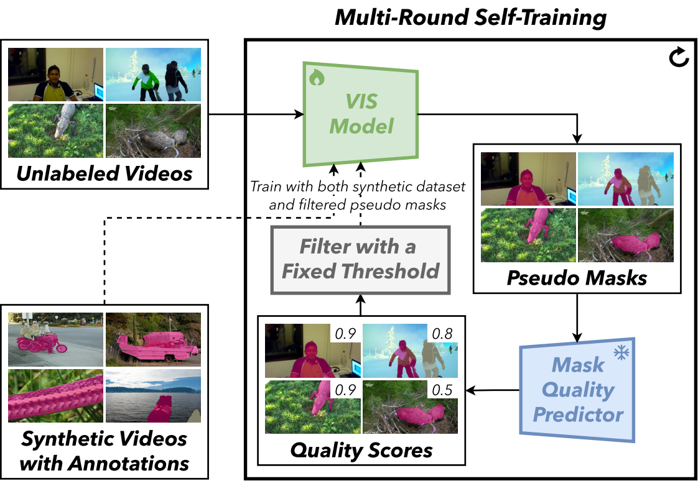

# AutoQ-VIS

By [Kaixaun Lu](https://github.com/wcbup), [Mehmet Onurcan Kaya](https://github.com/monurcan), [Dim P. Papadopoulos](https://dimipapa.github.io/).

This repository is an official implementation of the paper [AutoQ-VIS: Improving Unsupervised Video Instance Segmentation via Automatic Quality Assessment](https://arxiv.org/abs/2508.19808).

## Introduction

**TL; DR**.  We propose AutoQ-VIS, an unsupervised video instance segmentation framework that eliminates manual labeling via automatic quality assessment and self-training loops.

  

**Abstract**. Video Instance Segmentation (VIS) faces significant annotation challenges due to its dual requirements of pixel-level masks and temporal consistency labels. While recent unsupervised methods like VideoCutLER eliminate optical flow dependencies through synthetic data, they remain constrained by the synthetic-to-real domain gap. We present AutoQ-VIS, a novel unsupervised framework that bridges this gap through quality-guided self-training. Our approach establishes a closed-loop system between pseudo-label generation and automatic quality assessment, enabling progressive adaptation from synthetic to real videos. Experiments demonstrate state-of-the-art performance with 52.6 $\text{AP}_{50}$ on YouTubeVIS-2019 $\texttt{val}$ set, surpassing the previous state-of-the-art VideoCutLER by 4.4%, while requiring no human annotations. This demonstrates the viability of quality-aware self-training for unsupervised VIS.

## Installation
See [installation instructions](INSTALL.md).

## Dataset Preparation
See [Preparing Datasets for AutoQ-VIS](datasets/README.md).

## Train

Download the pre-trained VideoCutLer from this [link](https://github.com/facebookresearch/CutLER/tree/main/videocutler) and then place it in the AutoQ-VIS home directory.

Run script `train_Qpredictor.py` to initialize the quality predictor. You can download our trained weight from [here](https://huggingface.co/wcbup/AutoQ-VIS/resolve/main/model_Qpredictor.pth?download=true).

Run script `train_Mask2former.py` to train the VIS model. You can download our trained weight from [here](https://huggingface.co/wcbup/AutoQ-VIS/resolve/main/model_Mask2former.pth?download=true).

## Evaluation

Run scrip `eval.py` to evaluate the model.
